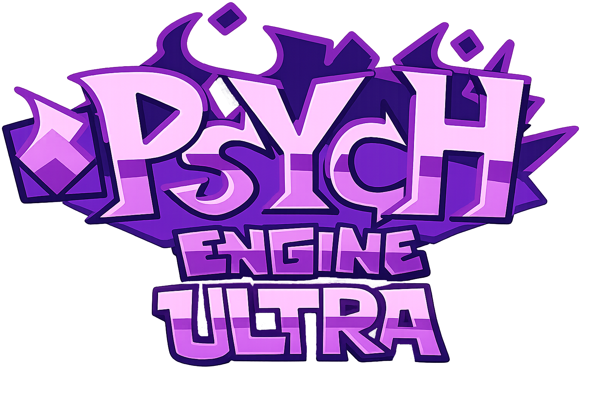

Psych Engine Ultra is a highly customizable and advanced fork of Psych Engine, originally used on Mind Games Mod. Ultra takes everything Psych Engine offers and pushes it further — delivering a more accessible, polished, and feature-rich experience for both players and modders.

# What's New In Ultra?
* Multi-language support — Currently supports Turkish. ehmm.. English, French, German and more languages are on the way! (Working on Language System)
* Enhanced Mod Support — Improved mod loading, organizing, and compatibility.
* Custom UI & Menus — Completely reworked menus for a cleaner and more modern look and feel.
* Highly Customizable — Even more options to tailor your experience

# Other Features
* Remote Bug Fix, Engine ID System: When a player first enters the game, it asks for a username; an engine ID is generated based on the username the player enters (e.g., sametgkte-abcd). If any bugs or issues arise in your game, we can use this engine ID to fix the game remotely (though I think this might be a bit difficult to implement).
* Custom Menu Design: Players can customize and redesign in-game menus (Main Menu, Freeplay, etc.) however they like (though I think this might be a Too Much difficult to implement)

## Mod Support
* Planning Codename & V-Slice Mod Support (idk)

## Main Menu (V3 Style)

## Options (V3 Style)

## Freeplay (V3 Style)

## Credits:
* SametGkTe - Owner Of Psych Engine Ultra and Coder
* Nexus - Helper of Psych Engine Ultra (Translations etc.)

## Mobile Credits: (Mightly Change)
* Homura - Head Porter of Psych Engine Mobile.
* Karim - Second Porter of Psych Engine Mobile.
* Moxie - Helper of Psych Engine Mobile.

### Psych Engine Credits
* Shadow Mario - Main Programmer and Head of Psych Engine.
* Riveren - Main Artist/Animator of Psych Engine.
* bbpanzu - Ex-Team Member (Programmer).
* crowplexus - HScript Iris, Input System v3, and Other PRs.
* Kamizeta - Creator of Pessy, Psych Engine's mascot.
* MaxNeton - Loading Screen Easter Egg Artist/Animator.
* Keoiki - Note Splash Animations and Latin Alphabet.
* SqirraRNG - Crash Handler and Base code for Chart Editor's Waveform.
* EliteMasterEric - Runtime Shaders support and Other PRs.
* MAJigsaw77 - .MP4 Video Loader Library (hxvlc).
* iFlicky - Composer of Psync, Tea Time and some sound effects.
* KadeDev - Fixed some issues on Chart Editor and Other PRs.
* superpowers04 - LUA JIT Fork.
* CheemsAndFriends - Creator of FlxAnimate.
* Ezhalt - Pessy's Easter Egg Jingle.
* MaliciousBunny - Video for the Final Update.

#### Psych Engine by ShadowMario, Friday Night Funkin' by ninjamuffin99
